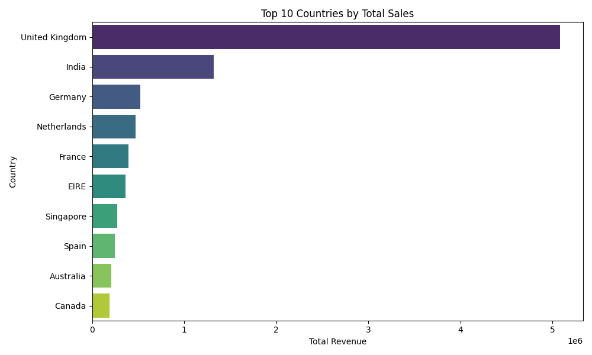
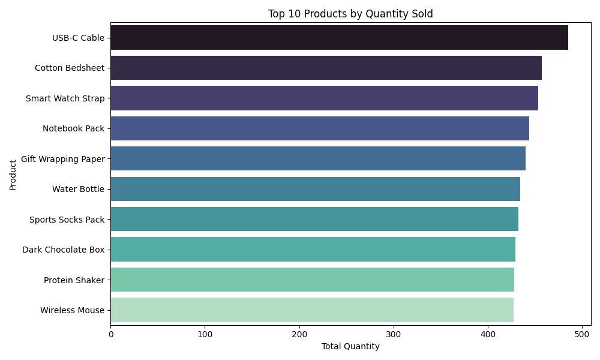
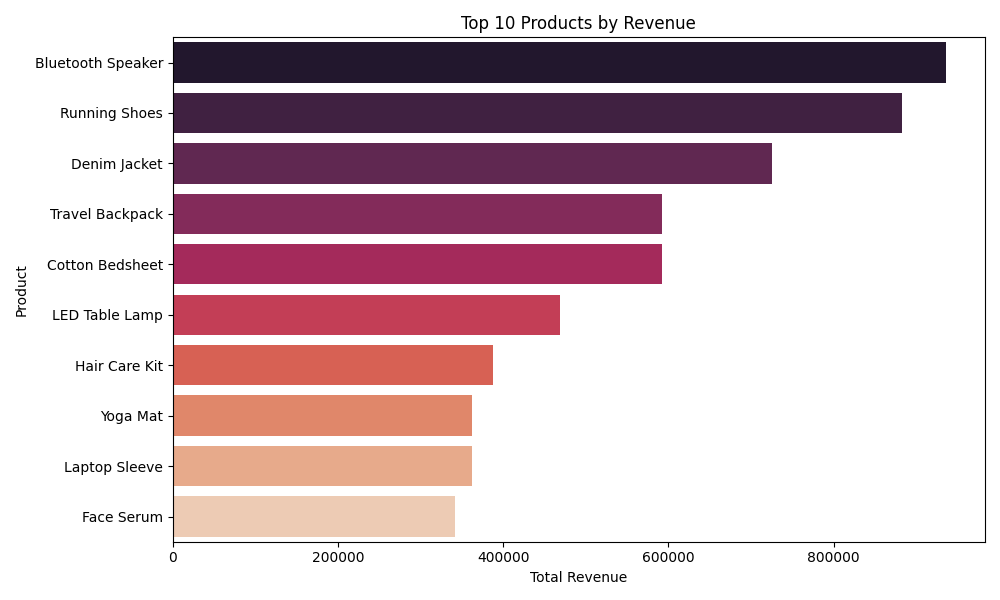
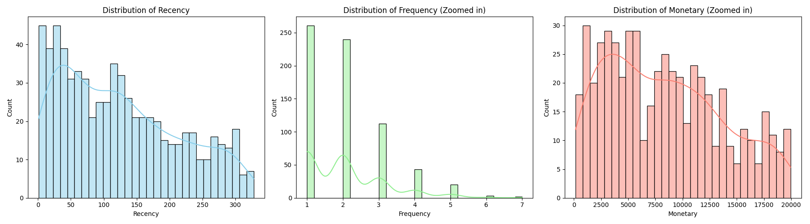
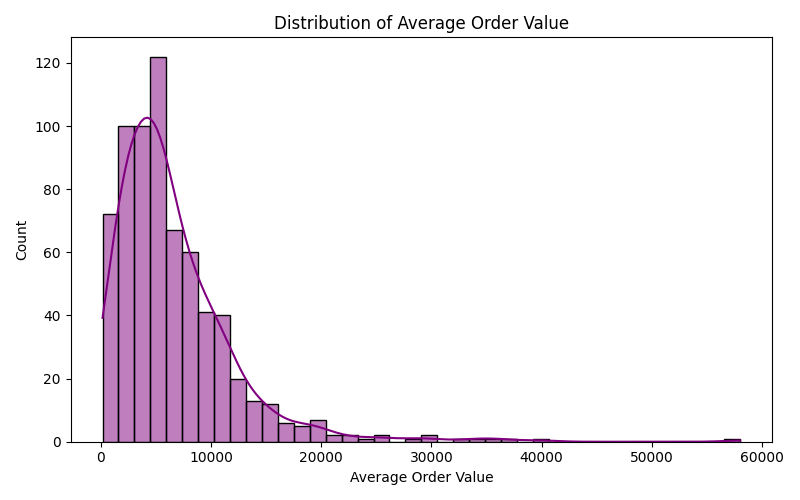
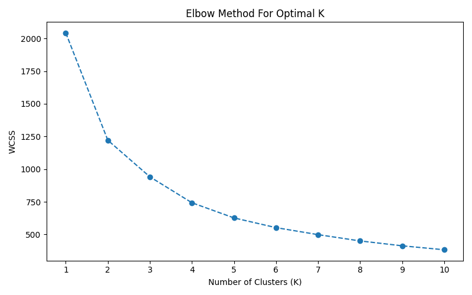

# E-Commerce Customer Segmentation using RFM and Clustering

## Project Title
E-Commerce Customer Segmentation: Identifying High-Value Customers and Improving Retention using Machine Learning

## Business Problem
The e-commerce company wants to design targeted marketing campaigns, improve customer retention, and identify high-value customer groups to optimize marketing spend. Without understanding different customer personas, the company risks sending generic promotions that do not resonate with their audience, leading to lost revenue and potential customer churn. The goal is to use historical transaction data to segment customers based on their purchasing behavior.

## Dataset Description (Data Understanding)
The dataset provides transactional information for an e-commerce platform. Here is a clear breakdown of the dataset characteristics:

- **What each column represents**:
  - `InvoiceNo`: Unique identifier for the transaction. If it starts with 'C', the order was cancelled or returned.
  - `StockCode`: Unique identifier for the specific product.
  - `Description`: The name or description of the product.
  - `Category`: The category the product belongs to (e.g., Grocery, Electronics).
  - `Quantity`: The number of items purchased in that specific transaction line.
  - `InvoiceDate`: The date and time the transaction occurred.
  - `UnitPrice`: The price per single unit of the product.
  - `CustomerID`: Unique identifier for the customer making the purchase.
  - `Country`: The country where the customer resides.

- **What a single row represents**:
  A single row represents a **single product line-item within a specific transaction**. This means if a customer buys 5 different products in one checkout, it will be recorded as 5 separate rows sharing the same `InvoiceNo` and `CustomerID`.

- **What type of business this dataset belongs to**:
  This dataset belongs to a **global e-commerce retail business** that sells a wide variety of consumer goods (like electronics, apparel, and home items) to customers across multiple countries.

- **What kind of customer or sales analysis can be done using this dataset**:
  - **RFM Analysis**: Segmenting customers based on Recency, Frequency, and Monetary value.
  - **Cohort Analysis**: Tracking customer retention over time.
  - **Market Basket Analysis**: Identifying which products are frequently bought together.
  - **Sales Trend Analysis**: Understanding seasonality and peak sales periods.

- **What business questions can be answered using this dataset**:
  - Who are our most valuable customers (VIPs) and who are at risk of churning?
  - Which countries generate the most revenue?
  - What are the top-selling products by quantity and revenue?
  - What is the average order value (AOV) per customer?

- **What business questions cannot be answered due to missing information**:
  - We cannot answer questions about **Customer Demographics** (e.g., age, gender, occupation) because that data is missing.
  - We cannot calculate **Profit Margins** because there is no data on the cost of goods sold (COGS).
  - We cannot determine **Marketing ROI** or **Customer Acquisition Cost** because we do not know which marketing channels brought the customers to the store.

## Data Cleaning Summary
Before diving into analysis, the dataset required rigorous cleaning to ensure data integrity. Here is a clear explanation of every cleaning step performed:

- **Missing customer IDs**: Dropped records where `CustomerID` was missing. Since the goal is customer segmentation, any transaction that cannot be tied to a specific customer is unusable.
- **Missing product descriptions**: Dropped rows with missing `Description`. These rows often correspond to system errors or unidentifiable items.
- **Negative or zero quantities**: Filtered out rows where `Quantity <= 0`. Negative quantities typically represent returns or errors, and zero quantities are invalid for sales analysis.
- **Zero or negative unit prices**: Filtered out rows where `UnitPrice <= 0`. These represent free items, adjustments, or errors, which distort revenue calculations.
- **Cancelled or returned invoices**: Removed all invoices where the `InvoiceNo` starts with the letter 'C'. These represent cancellations and should not be counted towards active sales or purchase frequency.
- **Duplicate records**: Removed exact duplicate rows to prevent artificially inflating a customer's purchase frequency or monetary value.
- **Incorrect data types**: Converted `InvoiceDate` from a string into a proper Datetime object for accurate Recency calculations. Converted `CustomerID` to a string since it is a categorical identifier, not a numeric metric.

## Feature Engineering Summary
To perform customer-level segmentation, the transaction data was aggregated from the invoice level to the customer level. We created the following specific features:

**Customer-Level Features:**
- **Total revenue per customer**: Calculated by summing `Quantity * UnitPrice` for all their purchases.
- **Total number of purchases**: The total count of transactions (invoices) associated with the customer.
- **Total quantity purchased**: The sum of all items bought by the customer across all orders.
- **Average order value (AOV)**: Total revenue divided by the total number of purchases.
- **Number of unique products purchased**: The count of distinct `StockCode`s the customer has bought.
- **Country of customer**: The country where the customer resides (using the first observed country per customer).

**RFM Table:**
We also created an RFM table to capture the core dimensions of customer behavior:
- **Recency**: How recently the customer made a purchase (calculated as the number of days between their last purchase and a "snapshot" date one day after the dataset's latest date).
- **Frequency**: How often the customer purchases (same as Total number of purchases).
- **Monetary**: How much the customer has spent (same as Total revenue per customer).

## EDA Insights
To deeply understand customer and sales behavior, we generated several visualizations (saved in the `/images` folder) to answer key business questions:

**1. Which countries generate the highest sales?**

*Interpretation*: The United Kingdom is by far the most dominant market, generating the highest sales volume. It is followed by India, France, Germany, and the Netherlands, which represent strong secondary markets.

**2. Which products are sold the most?**

*Interpretation*: Items such as 'Organic Cotton T-Shirt' and 'Smart Watch Strap' are sold in the highest volumes, indicating strong consumer demand for everyday basics and tech accessories.

**3. Which products generate the highest revenue?**

*Interpretation*: While basics sell in high volume, high-ticket items like 'Running Shoes', 'Bluetooth Speakers', and 'Denim Jackets' drive the majority of top-line revenue.

**4. What is the distribution of customer purchase frequency & order value?**


*Interpretation*: The distributions for Frequency, Monetary value, and Average Order Value are heavily right-skewed. The vast majority of customers purchase only 1-3 times and spend moderate amounts, whereas a small "long tail" of customers buys extremely often and spends vastly more.

**5. Are there outliers in quantity, price, or revenue?**
*Interpretation*: Yes, significant outliers exist. Prior to cleaning, there were extreme negative outliers (returns) and zero-priced items. Even after cleaning, the heavy right-skew in our distributions reveals positive outliers: a handful of customers (likely B2B wholesale buyers) who purchase items in massive quantities, generating exceptionally high revenue per order compared to the median shopper.

**6. Which customers appear to be high-value customers?**
*Interpretation*: High-value customers are easily identified in the extreme right tails of the Frequency and Monetary histograms. These are the VIP shoppers who place orders frequently and consistently have high Average Order Values, representing the core profitability of the business.

## Clustering Approach
To segment the customers, we applied the K-Means clustering algorithm. We followed these exact steps:

- **Select relevant features for clustering**: We selected **Recency, Frequency, and Monetary (RFM)** as the core features, as they best represent customer purchasing behavior.
- **Normalize or scale the data**: Because K-Means is distance-based and the RFM distributions are heavily right-skewed, we first applied a **Log Transformation** to handle the skewness. We then used a **Standard Scaler** to scale the data so that all features have a mean of 0 and a variance of 1.
- **Use the elbow method to choose a suitable number of clusters**: We calculated the Within-Cluster Sum of Squares (WCSS) for K values from 1 to 10.
  
  *Interpretation*: The "elbow" of the curve occurs at K=4, indicating that 4 is the optimal number of clusters to balance variance explained and model simplicity.
- **Train the K-Means model**: We trained the K-Means model using `n_clusters=4` on the scaled RFM data.
- **Assign cluster labels to customers**: The trained model generated cluster labels (0, 1, 2, 3), which were assigned and appended back to the original customer-level dataset as a new `Cluster` column.
- **Analyze each cluster**: We grouped the customers by their assigned cluster to calculate the average Recency, Frequency, and Monetary values for each group. The visual separation of these clusters and their detailed business analysis are provided in Section 6 below.

## 6. Cluster Interpretation
To understand the underlying characteristics of the 4 clusters, we analyzed their averages across the RFM dimensions:

**Cluster 0**
- **Possible customer type**: Recent Average Buyers / Promising
- **Customer behavior**: These customers have interacted with the business very recently but have only made a few purchases overall.
- **Spending pattern**: Moderate spending (~$10,500 average).
- **Purchase frequency**: Average frequency (~1.8 purchases).
- **Recency pattern**: Highly recent (~18 days since last purchase).
- **Business value of the segment**: Medium to High value. They are currently active and have high potential to become loyal if nurtured properly.

**Cluster 1**
- **Possible customer type**: At-Risk / Customers with Declining Activity
- **Customer behavior**: These customers used to buy from the store but haven't returned in several months.
- **Spending pattern**: Moderate to high spending historically (~$12,270 average).
- **Purchase frequency**: Average frequency (~1.6 purchases).
- **Recency pattern**: Declining activity, haven't purchased in a long time (~168 days).
- **Business value of the segment**: Medium value. Because they have demonstrated a willingness to spend in the past, winning them back is cheaper than acquiring new customers.

**Cluster 2**
- **Possible customer type**: Inactive / Occasional Buyers
- **Customer behavior**: These customers bought once or twice a long time ago and never returned. 
- **Spending pattern**: Lowest spending pattern (~$2,655 average).
- **Purchase frequency**: Lowest purchase frequency (~1.1 purchases).
- **Recency pattern**: Extremely high recency value, meaning a very long time since their last purchase (~176 days).
- **Business value of the segment**: Low value. They are likely one-off buyers who only bought a single discounted item.

**Cluster 3**
- **Possible customer type**: High Value Loyal / Frequent Buyers
- **Customer behavior**: These customers shop often and spend large amounts of money. They are the core drivers of revenue.
- **Spending pattern**: Highest spending pattern by far (~$26,013 average).
- **Purchase frequency**: Highest purchase frequency (~3.4 purchases).
- **Recency pattern**: Good recency pattern (~78 days on average, indicating they return consistently over the year).
- **Business value of the segment**: Extremely High value. This segment represents the most profitable and loyal customer base.

## Final Business Recommendations
Based on the cluster interpretation and EDA, here are the actionable recommendations for the business:

- **Loyalty rewards for high-value customers (Cluster 3)**: Implement an exclusive VIP loyalty program. Offer early access to new product drops, personalized shopping experiences, and premium customer support to ensure they never leave for a competitor.
- **Personalized offers for frequent buyers (Cluster 0)**: To encourage these recent, promising buyers to increase their frequency, send them personalized offers based on what they just bought. For example, if they bought a 'Smart Watch Strap', offer a small discount on a matching accessory to turn them into frequent buyers.
- **Special discounts for customers with declining activity (Cluster 1)**: Since these customers are at-risk, send aggressive "We miss you" win-back campaigns featuring special high-value discounts to incentivize their return.
- **Re-engagement campaigns for inactive customers (Cluster 2)**: Do not spend heavy marketing budget here. Limit efforts to generalized, low-cost re-engagement campaigns like seasonal sale announcements or generic newsletters.
- **Country-specific marketing strategies**: Since the UK heavily dominates sales, allocate the majority of the marketing budget locally to defend market share. Additionally, consider rolling out localized, country-specific campaigns and localized shipping discounts to boost sales in strong secondary markets like India, France, and Germany.

## How to Run the Project
1. Clone this repository to your local machine.
2. Ensure you have the necessary dependencies installed. You can install them using:
   ```bash
   pip install -r requirements.txt
   ```
3. Run the main script to clean data, perform EDA, and generate customer segments:
   ```bash
   python main.py
   ```
4. The output visualizations will be saved in the `images/` directory, and the final segmented dataset will be available in the `outputs/` directory.
